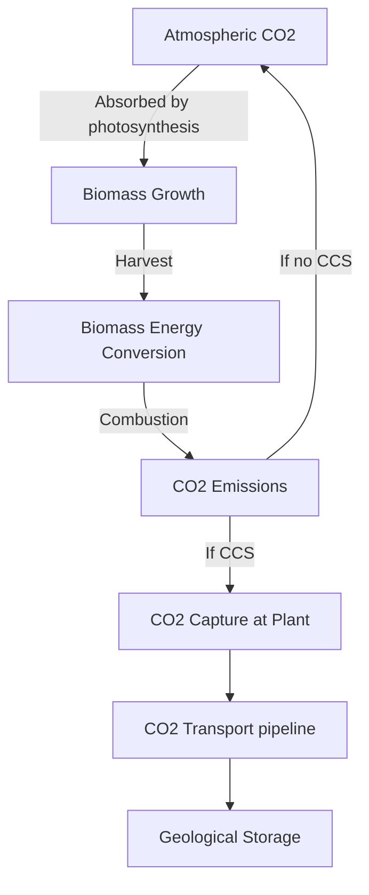

# Biomass, Biofuels, CCS & BECCS in GCAM: Comprehensive Reference for Pakistan Scenarios

**Version**: V3 (May 2026)
**Authors**: Hassan Niazi, with input from Zarrar Khan, Muhammad Awais
**Scope**: Theory, GCAM implementation, Pakistan diagnosis, and V3 solutions

---

## Table of Contents

1. [Concepts & Theory](#1-concepts--theory)
   - 1.1 [Biomass Energy Basics](#11-biomass-energy-basics)
   - 1.2 [Biofuel Generations](#12-biofuel-generations)
   - 1.3 [BECCS: The Carbon-Negative Loop](#13-beccs-the-carbon-negative-loop)
   - 1.4 [CCS Fundamentals](#14-ccs-fundamentals)
   - 1.5 [Carbon Storage Geology](#15-carbon-storage-geology)
   - 1.6 [Negative Emissions Technologies](#16-negative-emissions-technologies)
   - 1.7 [Bio Externalities](#17-bio-externalities)
   - 1.8 [Carbon Leakage](#18-carbon-leakage)
2. [GCAM Implementation Deep Dive](#2-gcam-implementation-deep-dive)
   - 2.1 [Biomass Supply Side](#21-biomass-supply-side)
   - 2.2 [Conversion Technologies (Demand Side)](#22-conversion-technologies-demand-side)
   - 2.3 [CCS & Carbon Storage in GCAM](#23-ccs--carbon-storage-in-gcam)
   - 2.4 [Guardrail Mechanisms](#24-guardrail-mechanisms)
   - 2.5 [Trade & Leakage Mechanisms](#25-trade--leakage-mechanisms)
   - 2.6 [Carbon Accounting Math](#26-carbon-accounting-math)
3. [Diagnosis: Pakistan Scenario Problems](#3-diagnosis-pakistan-scenario-problems)
   - 3.1 [Quantitative Evidence](#31-quantitative-evidence)
   - 3.2 [Missing Guardrails Comparison](#32-missing-guardrails-comparison)
   - 3.3 [Why BECCS Dominates](#33-why-beccs-dominates)
   - 3.4 [Why Biomass Exceeds Potential](#34-why-biomass-exceeds-potential)
   - 3.5 [Why Negative Emissions Reach 400 MtCO2](#35-why-negative-emissions-reach-400-mtco2)
   - 3.6 [Emissions Spillover to Other Regions](#36-emissions-spillover-to-other-regions)
4. [Pakistan Context: Literature & Data](#4-pakistan-context-literature--data)
   - 4.1 [Biomass Potential](#41-biomass-potential)
   - 4.2 [CO2 Storage Potential](#42-co2-storage-potential)
   - 4.3 [CCS Infrastructure Status](#43-ccs-infrastructure-status)
   - 4.4 [Pakistan Crop Data](#44-pakistan-crop-data)
5. [V3 Solutions & Implementation](#5-v3-solutions--implementation)
   - 5.1 [Solution Summary Table](#51-solution-summary-table)
   - 5.2 [Tier 1: Negative Emissions Budget](#52-tier-1-negative-emissions-budget)
   - 5.3 [Tier 1: Disable Offshore CCS](#53-tier-1-disable-offshore-ccs)
   - 5.4 [Tier 2: CCS Supply Cost Multiplier](#54-tier-2-ccs-supply-cost-multiplier)
   - 5.5 [Tier 3: Bio Ceiling](#55-tier-3-bio-ceiling)
   - 5.6 [V3 Config File Changes](#56-v3-config-file-changes)
   - 5.7 [Backup Plan if Solver Fails](#57-backup-plan-if-solver-fails)
6. [Deferred Solutions (Future Work)](#6-deferred-solutions-future-work)
7. [Appendices](#7-appendices)
   - A. [GCAM Biomass/CCS Technology Parameters](#a-gcam-biomassccs-technology-parameters)
   - B. [Pakistan Carbon Storage Data](#b-pakistan-carbon-storage-data)
   - C. [Key Constants from GCAM Data System](#c-key-constants-from-gcam-data-system)
   - D. [File Reference Index](#d-file-reference-index)

---

## 1. Concepts & Theory

### 1.1 Biomass Energy Basics

**Biomass** is organic matter that can be converted to energy. In the energy system, biomass serves as a renewable carbon-based fuel — unlike fossil fuels, the carbon in biomass was recently captured from the atmosphere by photosynthesis, creating a near-zero net CO2 cycle (before accounting for land-use change, processing, and transport).

**Types of biomass for energy:**

| Category | Examples | GCAM Representation |
|---|---|---|
| **Dedicated energy crops** | Switchgrass, miscanthus (grasses); willow, poplar (trees) | `biomassGrass`, `biomassTree` |
| **Agricultural residues** | Wheat straw, rice husks, cotton stalks, bagasse | `AgResidues` in residue biomass supply |
| **Forest residues** | Logging slash, branches, bark | `ForestResidues` |
| **Mill residues** | Sawmill waste, pulp mill waste | `MillResidues` |
| **Municipal solid waste (MSW)** | Organic fraction of urban waste | `generic waste biomass` |
| **Traditional biomass** | Fuelwood, dung, charcoal | `traditional biomass` |

**Energy content:** Biomass typically contains **17.5 GJ/t** (GCAM parameter `aglu.BIO_ENERGY_CONTENT_GJT`). For context:
- 1 tonne of coal ≈ 29 GJ
- 1 tonne of oil ≈ 42 GJ
- 1 tonne of biomass ≈ 17.5 GJ (about 60% the energy density of coal)

This lower energy density is a fundamental constraint on biomass energy — you need roughly twice the mass of biomass to deliver the same energy as coal, meaning higher transport costs, larger storage needs, and more land area.

### 1.2 Biofuel Generations

Biofuels are liquid fuels derived from biomass, designed to substitute for petroleum products.

**First-Generation (1G) Biofuels** — made from food crops using mature technology:

| Fuel | Feedstock | Process | GCAM Technology |
|---|---|---|---|
| **Corn ethanol** | Maize grain | Fermentation of starch | `corn ethanol` |
| **Sugar ethanol** | Sugarcane juice | Fermentation of sugars | `sugar cane ethanol` |
| **Biodiesel** | Vegetable oils (soy, rapeseed, palm) | Transesterification | `biodiesel` |

Key limitation: competes directly with food production for the same land and feedstock.

**Second-Generation (2G) Biofuels** — made from non-food biomass (cellulose, lignin):

| Fuel | Feedstock | Process | GCAM Technology | Efficiency |
|---|---|---|---|---|
| **Cellulosic ethanol** | Switchgrass, crop residues, wood | Enzymatic hydrolysis + fermentation | `cellulosic ethanol` | ~49% (coef 2.057) |
| **Fischer-Tropsch (FT) biofuels** | Any biomass | Gasification + FT synthesis | `FT biofuels` | ~51% (coef 1.961) |
| **Biomass gasification** | Biomass | Gasification to syngas | `biomass gasification` | ~74% (coef 1.343) |
| **BTL with hydrogen** | Biomass + H2 | Gasification + H2 addition | `BTL with hydrogen` | Complex multi-input |

Key advantage: doesn't compete with food crops (uses waste, residues, or dedicated non-food crops).
Key limitation: higher capital costs, less mature technology, lower yields per hectare than food-based ethanol.

**CCS variants of 2G biofuels** — same technologies with CO2 capture added:
- **Cellulosic ethanol CCS Level 1**: captures only fermentation CO2 (~26% of total)
- **Cellulosic ethanol CCS Level 2**: captures 90% of all process CO2
- **FT biofuels CCS Level 1**: captures 81.8% of CO2
- **FT biofuels CCS Level 2**: captures 90% of CO2

The CCS variants have higher conversion coefficients (lower efficiency) because capture equipment requires energy:
- Cellulosic ethanol: 2.057 → 2.263 (CCS L2) → ~10% efficiency penalty
- FT biofuels: 1.961 → 2.157 (CCS L2) → ~10% efficiency penalty

### 1.3 BECCS: The Carbon-Negative Loop

**Bioenergy with Carbon Capture and Storage (BECCS)** is the combination of biomass energy conversion with CCS technology. It is the primary mechanism by which IAMs (including GCAM) achieve **net negative CO2 emissions**.

**The carbon cycle logic:**

```
                    Atmospheric CO2
                    ↑ (released)    ↓ (absorbed by photosynthesis)
                    |               |
              [if no CCS]     [Biomass Growth]
                    |               |
                    ↑               ↓
              [Combustion] ← [Biomass Harvest]
                    |
              [if CCS]  →  [CO2 Capture at Plant]
                                    |
                                    ↓
                            [CO2 Transport (pipeline)]
                                    |
                                    ↓
                            [Geological Storage]
                            (permanently removed
                             from atmosphere)
```




**Without CCS**: Biomass combustion releases CO2, but this is the *same* CO2 that was recently absorbed from the atmosphere during growth. Net lifecycle CO2 ≈ 0 (ignoring land-use change and processing emissions). This is "carbon neutral."

**With CCS (BECCS)**: The CO2 released during combustion is captured before it reaches the atmosphere and permanently stored underground. Since the biomass absorbed CO2 from the atmosphere during growth, and that CO2 is now stored underground, the net effect is **removal of CO2 from the atmosphere** — i.e., **negative emissions**.

**Quantifying negative emissions per unit of energy:**
- Biomass carbon content: ~23 tC/TJ (fuel-C-coef for regional biomass)
- At 90% capture rate (CCS Level 2): 23 × 0.90 = **20.7 tC removed per TJ** of biomass processed
- Converting: 20.7 tC × (44/12) = **75.9 tCO2 removed per TJ**
- For 1 EJ of biomass: ~75,900 tCO2 removed = **~76 MtCO2 per EJ**

This is why BECCS is so attractive to the model under carbon pricing — every GJ of BECCS biomass processed earns a carbon price credit of approximately $C_price × 75.9 tCO2/TJ$.

**Real-world considerations often underestimated by models:**
- Land-use change emissions from growing biomass can partially offset negative emissions
- Energy penalty of CCS (10-20% of output) reduces net energy production
- Lifecycle emissions from fertilizer, harvesting, transport add ~5-15% positive emissions
- Biomass supply chains have seasonal variability and weather dependence
- Geological storage permanence has uncertainty over centuries

### 1.4 CCS Fundamentals

**Carbon Capture and Storage (CCS)** is a set of technologies that capture CO2 from industrial point sources, transport it, and store it permanently in geological formations.

**Three capture approaches:**

| Method | How It Works | Typical Capture Rate | Energy Penalty |
|---|---|---|---|
| **Post-combustion** | CO2 scrubbed from flue gas after combustion using chemical solvents (e.g., amines) | 85-95% | 25-40% increase in fuel use |
| **Pre-combustion** | Fuel gasified to syngas (CO + H2), CO shifted to CO2, then separated before combustion. H2 used as fuel. | 85-95% | 15-25% |
| **Oxy-fuel** | Fuel burned in pure oxygen instead of air, producing concentrated CO2 stream | 90-98% | 20-30% (O2 production) |

**GCAM capture rates** (from globaltech_co2capture files):
- Electricity CCS technologies: 85% (initial) → 95% (by 2100)
- Refining CCS Level 1: 26-82% (depends on tech — cellulosic ethanol L1 is only 26%)
- Refining CCS Level 2: 90% (all technologies)
- Industrial CCS: 90% (cement, ammonia, iron/steel, chemicals, aluminum, paper)
- Hydrogen CCS: 85% → 95%

**Transport:** CO2 is compressed to supercritical state (~100 atm) and transported via pipeline. Costs depend on distance, terrain, and volume. GCAM does not model transport explicitly — it's embedded in storage costs.

**Storage:** CO2 is injected into deep geological formations (>800m depth) where pressure and temperature keep it in supercritical (liquid-like) state. The overlying cap rock (impermeable layer) prevents upward migration.

### 1.5 Carbon Storage Geology

**Geological storage reservoirs for CO2:**

| Type | Description | Typical Capacity | Pakistan Status |
|---|---|---|---|
| **Depleted oil/gas fields** | Previously exploited hydrocarbon reservoirs with known cap rock integrity | Moderate (proven seals) | Depleted oil plays: 3,750 MtCO2 in SE Asia region |
| **Deep saline formations (onshore)** | Porous rock saturated with brine, typically sandstone or carbonate | Very large | **Zero** in Dooley data for Pakistan's GCAM3 region |
| **Deep saline formations (offshore)** | Same as onshore but under seabed | Very large | Modeled as unlimited global resource |
| **Unmineable coal seams** | Deep coal beds where CO2 can be adsorbed onto coal surfaces | Small-moderate | **Zero** in Dooley data |
| **Gas basins** | Existing natural gas geological structures | Large | 33,000 MtCO2 in SE Asia region |

**Key geology for Pakistan:**
Pakistan's Indus Basin contains significant depleted oil and gas plays. The Dooley (2006) dataset — the standard GCAM source — assigns Pakistan's parent GCAM3 region ("Southeast Asia") a total of 36,750 MtCO2 of onshore storage, entirely from depleted oil plays (3,750 MtCO2) and gas basins (33,000 MtCO2). Pakistan's share is allocated by land area fraction.

Pakistan has **no deep saline formations** and **no coal basins** for CO2 storage in the Dooley data. The offshore resource is modeled as a global unlimited resource at ~$75/tCO2 (2005$).

### 1.6 Negative Emissions Technologies

"Negative emissions" = net removal of CO2 from the atmosphere. Three main approaches:

| Technology | Mechanism | Maturity | GCAM Representation |
|---|---|---|---|
| **BECCS** | Biomass growth absorbs CO2 → combustion + CCS stores it | Pilot/demo | Biomass electricity CCS, cellulosic ethanol CCS, FT biofuels CCS, biomass-to-H2 CCS |
| **Direct Air Capture (DAC)** | Chemical/physical processes extract CO2 directly from ambient air | Early commercial | `hightemp DAC NG`, `hightemp DAC elec`, `lowtemp DAC heatpump` |
| **Afforestation/LULUCF** | Trees absorb CO2 during growth; carbon stored in biomass and soil | Mature | Land-use change carbon accounting (AFOLU CO2) |

**Why BECCS dominates in models:** Under carbon pricing, BECCS produces *both* energy *and* negative emissions credits. It's the only technology that generates revenue from two sources simultaneously: energy sales and carbon removal payments. DAC, by contrast, only earns carbon removal credits while consuming energy. This "double dividend" makes BECCS extremely cost-competitive in the model's optimization logic.

**The negative emissions budget mechanism** limits total spending on negative emissions to a fraction of GDP (default 1%), preventing the model from allocating unrealistic resources to BECCS/DAC. Without this budget, BECCS deployment can grow unbounded.

### 1.7 Bio Externalities

Biomass energy at scale creates externalities not fully captured in market prices:

**Direct Land-Use Change (dLUC):** Converting natural land (forest, grassland) to bioenergy crops releases stored carbon and reduces biodiversity. GCAM accounts for this through its land allocation model.

**Indirect Land-Use Change (iLUC):** If bioenergy crops displace food crops, food production may expand into previously natural land elsewhere. This is modeled through GCAM's agricultural trade and land competition.

**Food vs. Fuel:** First-generation biofuels (corn ethanol, sugar ethanol, biodiesel) directly compete with food production. Second-generation biofuels mitigate this by using non-food biomass, but still compete for land.

**Water Stress:** Bioenergy crops require irrigation (or rainfall), competing with food crops and ecosystems for water. Pakistan's Indus Basin is already water-stressed.

**Biodiversity:** Large-scale monoculture plantations (biomassGrass, biomassTree) reduce habitat diversity.

**GCAM's bio externality mechanism:** An escalating cost function applied to all purpose-grown biomass globally:
- First 75 EJ: nearly free ($0.01/GJ)
- 75-175 EJ: $1.50/GJ
- 175-475 EJ: $3.00/GJ

This is a soft guardrail — it raises costs but doesn't impose a hard cap.

### 1.8 Carbon Leakage

**Carbon leakage** occurs when constraining emissions in one region causes production (and emissions) to shift to unconstrained regions. In the Pakistan context:

1. **Biomass trade leakage:** Pakistan's emission constraint raises its carbon price → BECCS becomes profitable → Pakistan imports biomass from other regions → those regions expand biomass production (potentially causing land-use change emissions elsewhere)

2. **Production shifting:** Energy-intensive industries may relocate production to regions without carbon pricing, increasing emissions there while reducing them in Pakistan

3. **Agricultural trade:** If Pakistan's carbon price affects agricultural costs, food imports may increase, shifting agricultural emissions abroad

GCAM models biomass trade explicitly through the `bio_trade.xml` system (domestic vs. imported biomass with share-weight competition). However, when Pakistan is the *only* region with an emissions constraint, the model can freely import biomass from all other (unconstrained) regions, making leakage virtually unchecked.

---

## 2. GCAM Implementation Deep Dive

### 2.1 Biomass Supply Side

#### 2.1.1 Dedicated Bioenergy Crops

**Data flow:**
```
FAO crop production → L163.bio_Yield_R_GLU_irr.R → yields by region × GLU × IRR
                                ↓
                   L2012.ag_For_Past_bio_input.R → biomassGrass/biomassTree supply sectors
```

**Yield computation** (`zaglu_L163.bio_Yield_R_GLU_irr.R`):
1. Global average yield calculated for each GTAP crop
2. Per-region yield index: `YieldIndex = Ratio_weight / HA` (relative to global average)
3. Base yield anchored to USA: `base_yield = MAX_BIO_YIELD_THA / max(YieldIndex[USA])`
4. Final: `Yield_GJm2 = YieldIndex × base_yield_GJm2`

**Key parameters:**

| Parameter | Value | File | Effect |
|---|---|---|---|
| `aglu.MAX_BIO_YIELD_THA` | 20 t/ha | `constants.R` | Maximum switchgrass yield (USA reference). Directly scales ALL bioenergy crop yields globally. |
| `aglu.BIO_ENERGY_CONTENT_GJT` | 17.5 GJ/t | `constants.R` | Energy content of biomass. |
| `aglu.BIO_GRASS_COST_75USD_GJ` | $0.75/GJ | `constants.R` | Non-land variable cost of biomass grass production. |
| `aglu.BIO_TREE_COST_75USD_GJ` | $0.67/GJ | `constants.R` | Non-land variable cost of biomass tree production. |
| `aglu.MGMT_YIELD_ADJ` | 0.2 | `constants.R` | Hi/Lo management yield spread (±20%). |

**Pakistan-specific:** Pakistan gets the "Low" ghost share preference (`A_biomassSupplyShare_R.csv`), meaning dedicated bioenergy crops phase in slowly: share-weight ramps 0 → 0.01 → 0.01 → 0.02 → 0.02. However, under high carbon prices (net-zero scenarios), the model overrides this slow phase-in because BECCS profitability is so high.

#### 2.1.2 Residue Biomass

Three sources, each with a price-availability supply curve:

**Supply curves** (`A_resbio_curves.csv`):

| Price (1975$/GJ) | Agricultural | Forest | Mill |
|---|---|---|---|
| 0 | 0% | 0% | 0% |
| **1.2** | **25%** | **60%** | **80%** |
| 2.0 | 65% | 80% | 90% |
| 6.0 | 100% | 100% | 100% |

At $1.2/GJ, only 25% of agricultural residues are supplied. At $6/GJ, all available residues enter the market. Forest and mill residues are mobilized earlier because they're already concentrated at processing sites.

**Pakistan base-year fractions** (`A_bio_frac_prod_R.csv`):

| Source | Fraction Collected | Meaning |
|---|---|---|
| Agricultural residues | **0.210** | Only 21% of crop residues are currently used for energy |
| Forest residues | **0.591** | 59% of logging residues collected |
| Mill residues | **0.800** | 80% of mill waste used |

**Key residue parameters** (`zaglu_L111.ag_resbio_R_C.R`):
- `HarvestIndex`: production-weighted average by region × crop (determines how much residue is generated per unit of crop production)
- `ErosCtrl`: erosion control — fraction of residues that MUST remain on the field (cannot be harvested for energy)
- `ResEnergy`: energy content of residues (GJ/t dry matter)
- `WaterContent`: moisture fraction (affects actual energy delivered)

#### 2.1.3 MSW and Traditional Biomass

**MSW** (`A13.MSW_curves.csv`): Municipal solid waste supply curve, tied to urban population and waste generation rates. Small contribution to total biomass.

**Traditional biomass** (`A17.tradbio_curves.csv`): Fuelwood, dung, and charcoal. Pakistan is in `tradbio_region=1`, meaning it has significant traditional biomass use. This is modeled separately from modern bioenergy and typically declines over time as households switch to modern fuels.

### 2.2 Conversion Technologies (Demand Side)

#### 2.2.1 Biomass Electricity

Technologies in the `electricity` → `biomass` subsector:

| Technology | Efficiency | CCS? | Capture Rate | Capital Cost Trend | Source File |
|---|---|---|---|---|---|
| biomass (conv) | 26.6% | No | — | Moderate | `A23.globaltech_eff.csv` |
| biomass (conv CCS) | 19.6% | **Yes** | 85→95% | High | `A23.globaltech_co2capture.csv` |
| biomass (IGCC) | 32.0→41.6% | No | — | High (improving) | `A23.globaltech_eff.csv` |
| biomass (IGCC CCS) | 26.2% | **Yes** | 85→95% | Very high | `A23.globaltech_co2capture.csv` |

**Efficiency penalty of CCS:** Adding CCS to conventional biomass drops efficiency from 26.6% to 19.6% — a **26% relative reduction**. For IGCC, it drops from ~42% to 26.2% — a **37% relative reduction**. This energy penalty is a real physical constraint: capturing, compressing, and transporting CO2 requires significant energy.

**`elec_bio_low.xml`**: An available add-on that sets pessimistic (high) capital costs for biomass electricity. Used in SSP3 scenarios to slow biomass power deployment. Currently NOT loaded in any Pakistan config.

#### 2.2.2 Biofuel Refining

Technologies in the `refining` → `biomass liquids` subsector:

| Technology | Input→Output Coef | Efficiency | CCS? | Capture Rate |
|---|---|---|---|---|
| cellulosic ethanol | 2.057→1.771 | 49→56% | No | — |
| cellulosic ethanol CCS L1 | 2.139→1.842 | 47→54% | Yes | **26%** (fermentation CO2 only) |
| cellulosic ethanol CCS L2 | 2.263→1.948 | 44→51% | Yes | **90%** |
| FT biofuels | 1.961→1.739 | 51→58% | No | — |
| FT biofuels CCS L1 | 2.039→1.809 | 49→55% | Yes | **81.8%** |
| FT biofuels CCS L2 | 2.157→1.913 | 46→52% | Yes | **90%** |
| corn ethanol | 1.0 | pass-through | No | — |
| sugar cane ethanol | 1.0 | pass-through | No | — |
| biodiesel | 1.031→1.03 | ~97% | No | — |
| biomass gasification | 1.343→1.227 | 74→82% | No | — |

**Important note on cellulosic ethanol CCS L1:** The 26% capture rate is uniquely low because this technology captures *only* the CO2 released during fermentation (a relatively pure, low-volume CO2 stream). CCS Level 2 captures 90% of ALL process CO2 (including combustion for process heat).

**Non-energy costs** (`A22.globaltech_cost.csv`, 1975$/GJ):

| Technology | Cost | Learning |
|---|---|---|
| Cellulosic ethanol | $4.74/GJ | max 70% improvement, 3%/yr |
| Cellulosic ethanol CCS L1 | $4.99/GJ | max 60%, 5%/yr |
| FT biofuels | $7.80/GJ | max 70%, 3%/yr |
| FT biofuels CCS L1 | $8.52/GJ | max 60%, 5%/yr |
| Corn ethanol | $2.38/GJ | fixed |
| Biodiesel | $1.88/GJ | fixed |

**Pakistan-specific:** Pakistan is configured for **corn ethanol** (`A_regions.csv`, `ethanol=corn ethanol`) despite sugarcane being the dominant crop (~38 Mt vs ~1.6 Mt maize). The biodiesel feedstock is `OilCrop` (rapeseed). This is a known inaccuracy — see [Section 6](#6-deferred-solutions-future-work).

#### 2.2.3 Hydrogen from Biomass

| Technology | CCS? | Capture Rate | Derivation |
|---|---|---|---|
| biomass to H2 | No | — | Based on biomass IGCC ratios |
| biomass to H2 CCS | Yes | 85→95% | Cost/efficiency adders from IGCC CCS vs IGCC |

#### 2.2.4 Industrial Biomass CCS

Multiple industrial sectors have biomass CCS options (all at 90% capture rate):
- **Cement**: cement CCS
- **Chemicals**: biomass CCS
- **Iron & Steel**: BLASTFUR CCS, EAF with DRI CCS
- **Aluminum**: biomass CCS
- **Paper**: biomass CCS

### 2.3 CCS & Carbon Storage in GCAM

#### 2.3.1 Storage Supply Curves

**Source data:** Dooley (2006) global assessment of CO2 storage capacity by geological formation type.

**Processing pipeline** (`zenergy_L161.Cstorage.R`):
1. Start with 14 GCAM3 regions × 5 reservoir types
2. Exclude offshore deep saline formations from onshore total
3. Sum remaining reservoirs per GCAM3 region
4. Distribute across 6 cost grades using fixed fractions
5. Downscale GCAM3 regions → countries using **land area shares**
6. Aggregate countries → GCAM regions
7. Convert MtCO2 → MtC (÷3.667); costs → 1990$/tC

**Cost grade structure** (`A61.Cstorage_curves.csv`):

| Grade | Fraction of Total | Cost (2005$/tCO2) | Cost (1990$/tC) |
|---|---|---|---|
| 1 | 0% | $0 | $0 |
| 2 | 0.5% | $0.10 | $0.27 |
| 3 | 10% | $5.00 | $13.33 |
| 4 | **60%** | $10.00 | $26.66 |
| 5 | 29.5% | $75.00 | $199.97 |
| 6 | 0% | $3,500 | $9,332 (backstop) |

Most storage (60%) is in grade 4 at $10/tCO2 — this is the "bulk" of available geological storage. Grade 5 at $75/tCO2 is the expensive tail.

**Onshore vs. Offshore:**
- **Onshore**: `depletable-resource`, regional market, graded supply curve
- **Offshore**: `unlimited-resource`, **global** market, cost = ~$75/tCO2 (2005$)

#### 2.3.2 Pakistan's Onshore Storage

Pakistan's storage comes from the "Southeast Asia" GCAM3 region (allocated by land area):

| Grade | Available (MtC) | Cost (1990$/tC) | Approx. MtCO2 |
|---|---|---|---|
| 1 | 0 | $0 | 0 |
| 2 | 6.7 | $0.27 | 25 |
| 3 | 135 | $13.33 | 495 |
| 4 | 809.8 | $26.66 | 2,970 |
| 5 | 398.2 | $199.97 | 1,460 |
| **Total** | **~1,350 MtC** | | **~4,950 MtCO2** |

At Pakistan's current E&IP emissions (~240-280 MtCO2/yr), this onshore capacity could store ~18-21 years of total emissions if all were captured. For BECCS alone (which captures a fraction of emissions), this is ample for decades.

**Offshore:** Unlimited at global price (~$75/tCO2). This means Pakistan can access essentially infinite storage — **a key problem** since Pakistan has no offshore CCS infrastructure or plans.

#### 2.3.3 SSP CCS Cost Variants

Different SSPs apply multipliers to the base CCS extraction costs:

| Scenario File | Multiplier | Effect | Used In |
|---|---|---|---|
| `ccs_supply_lowest.xml` | ×0.8 | Cheaper than base (high CCS use) | SSP1 |
| `ccs_supply_low.xml` | **×3.0** | Moderately more expensive | **SSP2, SSP3** |
| `ccs_supply_high.xml` | ×10.0 | Very expensive | SSP4, SSP5 |

**`no_offshore_ccs.xml`:** Sets offshore carbon-storage technology `share-weight=0` for all periods, effectively disabling offshore CCS globally. Used in **SSP1, SSP2, SSP3**.

**`turn_off_ccs.xml`:** Sets ALL CCS technology share-weights to 0 (biomass CCS, coal CCS, gas CCS in electricity; cellulosic ethanol CCS, FT biofuels CCS, coal-to-liquids CCS in refining). Complete CCS disable. Not currently loaded in any config.

**`high_cost_ccs.xml`:** Sets onshore carbon-storage technology cost to $10,000/tCO2 — effectively prices out CCS without removing technologies. Not currently loaded.

### 2.4 Guardrail Mechanisms

GCAM includes several mechanisms to prevent unrealistic outcomes. These are critical for producing plausible scenarios.

#### 2.4.1 Bio Externality Cost

**File:** `bio_externality.xml` (generated by `zenergy_L270.limits.R`)
**Status in Pakistan configs:** LOADED (present in all V2 and V3 configs)

Creates a `renewresource` named `bio_externality_cost` with a global supply curve:

| Grade | Available (EJ) | Cost (1975$/GJ) | Cumulative |
|---|---|---|---|
| 2 | 75 | $0.01 | 75 EJ |
| 3 | 100 | $1.50 | 175 EJ |
| 4 | 300 | $3.00 | 475 EJ |

Every bioenergy crop (biomassGrass, biomassTree) has a `minicam-energy-input` for `bio_externality_cost` with coefficient=1. This adds an escalating cost as total **global** biomass production increases.

**Limitation:** The externality is *global* — Pakistan's ~1-2 EJ of biomass barely registers on a curve that doesn't start biting until 75+ EJ. This guardrail is designed for global scenarios, not single-region studies.

#### 2.4.2 Negative Emissions Budget

**File:** `negative_emissions_budget.xml` (generated by `zenergy_L270.limits.R`)
**Status in V2 Pakistan configs:** **NOT LOADED** ← Critical gap
**Status in V3 Pakistan configs:** **LOADED** (Tier 1)

**How it works:**

1. A `ctax-input` named `negative_emiss_budget` is added to ALL biomass/ethanol/woodpulp supply sectors plus DAC (`airCO2`), using their carbon coefficients (`fuel-C-coef`)
2. A `LandRootNegEmissMkt` connects the land system to the negative emissions policy
3. A RES (Renewable Energy Standard) portfolio constraint is created per region with `constraint = 0.0`
4. Max price = 1.0 (representing a fraction, 0 to 100%)
5. Budget fraction = **1% of GDP** (`energy.NEG_EMISS_GDP_BUDGET_PCT = 0.01`)
6. Market scope: **global** by default (`energy.NEG_EMISS_MARKT_GLOBAL = TRUE`)

**Effect:** When BECCS/DAC technologies receive a carbon price credit for negative emissions, this mechanism limits the *total spending* on those credits to 1% of GDP. This prevents the model from allocating a disproportionate share of economic resources to negative emissions technologies.

**Why this is the most impactful single fix:** Without the budget, BECCS in a net-zero scenario gets an *uncapped* carbon price credit. With Pakistan's carbon price potentially reaching hundreds of $/tCO2 to achieve net-zero, the model sees BECCS as enormously profitable — it produces energy AND earns huge negative emissions credits. The budget caps this incentive.

**Key constants:**

| Parameter | Value | File |
|---|---|---|
| `energy.NEG_EMISS_GDP_BUDGET_PCT` | 0.01 (1%) | `constants.R` |
| `energy.NEG_EMISS_MARKT_GLOBAL` | TRUE | `constants.R` |
| `energy.NEG_EMISS_POLICY_NAME` | `"negative_emiss_budget"` | `constants.R` |
| `energy.NEG_EMISS_TARGET_GAS` | `"CO2_LTG"` | `constants.R` |

#### 2.4.3 Bio Ceiling (Price Cap)

**Files:** `bio_ceiling-market-v1_byu.xml` + `bio_ceiling-AR6_C4-90th_percentile_2100-T30.xml`
**Status in V2 Pakistan configs:** **NOT LOADED** ← Files exist in repo but never wired in
**Status in V3 Pakistan configs:** **LOADED** (Tier 3)

**How it works:**

1. `bio_ceiling-market-v1_byu.xml` adds an `<input-tax name="bio-ceiling"/>` to biomass technologies:
   - `regional biomass` (solid biomass for electricity/heat)
   - `regional corn for ethanol` (1st-gen)
   - `regional sugar for ethanol` (1st-gen)
   - `regional biomassOil` → Soybean, OilCrop, OilPalm (biodiesel feedstocks)

2. `bio_ceiling-AR6_C4-90th_percentile_2100-T30.xml` sets a `policy-portfolio-standard` named `bio-ceiling` as a **tax** on a **global** market:

| Year | Ceiling Price (1990$/GJ) |
|---|---|
| 2030 | 49.4 |
| 2035 | 60.7 |
| 2040 | 71.9 |
| 2050 | 94.5 |
| 2060 | 117.1 |
| 2100 | 232.4 |

**Effect:** When the carbon price pushes biomass prices above these ceiling values, the model faces this as an additional cost, dampening further biomass demand. It prevents the carbon price from creating an arbitrarily large subsidy for biomass use.

**Source:** AR6 Category 4 scenario, 90th percentile biomass price trajectory to 2100, T30 threshold. This is a generous ceiling — most GCAM scenarios won't hit it except in very aggressive mitigation.

#### 2.4.4 Liquids Limits (Oil Credits)

**File:** `liquids_limits.xml` (generated by `zenergy_L270.limits.R`)
**Status:** LOADED in all configs

**Mechanism:** Oil refining generates "oil-credits" as a secondary output (ratio=1.0). Electricity and feedstock sectors must consume a minimum fraction of oil-derived products:
- `energy.OILFRACT_ELEC = 1.0` → 100% of refined liquids for electricity must be oil-derived
- `energy.OILFRACT_FEEDSTOCKS = 0.8` → 80% for feedstocks

This prevents bioliquids from completely displacing oil in these sectors.

### 2.5 Trade & Leakage Mechanisms

#### 2.5.1 Biomass Trade Structure

**File:** `bio_trade.xml` (generated by `zaglu_L243.bio_trade_input.R`)

GCAM replaces the simple global biomass market with a three-tier trade structure:

```
regional biomass (consumed by conversion techs)
    ↓ replaced by:
total biomass (regional market)
    ├── domestic biomass → consumes "biomass" from regional supply
    └── imported biomass → consumes "traded biomass" from trade region (USA)
            traded biomass (in USA region, global trade hub)
                ├── Pakistan traded biomass → biomass from Pakistan
                ├── India traded biomass → biomass from India
                └── ... (all 32 regions)
```

**Share-weight logic:**

| SSP | Domestic SW | Imported SW | Effect |
|---|---|---|---|
| Default | 1.0 | 0.1→0.5 (by 2050) | Moderate trade |
| SSP3 | 1.0 | **0.1** (fixed) | Very restricted trade |
| SSP4 (low income) | 1.0 | 0.1 | Restricted |
| SSP4 (high income) | 1.0 | 0.5 | Free trade within high-income bloc |

**Pakistan implication:** With default share-weights, imported biomass starts at 0.1 (10% of domestic preference) and rises to 0.5 by 2050. Under high carbon prices, the model exploits this trade channel to import biomass for BECCS. No Pakistan-specific trade restrictions exist.

### 2.6 Carbon Accounting Math

**CO2 ↔ Carbon conversion:** 1 tC = 3.667 tCO2 (molecular weight ratio 44/12)

**BECCS negative emissions calculation:**

For a technology with:
- Fuel carbon coefficient `C` (tC/TJ or tC/EJ)
- CCS capture rate `r` (fraction, e.g., 0.90)

The negative emissions per unit energy = `C × r × (-1)` (in tC)
Converting to tCO2: multiply by 3.667

Example — **Biomass electricity (conv CCS)**:
- Fuel-C-coef for `regional biomass` ≈ 23 tC/TJ
- Capture rate: 0.90 (Level 2)
- Negative emissions: 23 × 0.90 = 20.7 tC/TJ = 75.9 tCO2/TJ
- For 1 EJ input: 75,900 tCO2 removed = **~76 MtCO2/EJ**

**How carbon price creates the BECCS subsidy:**

When a carbon price `P` ($/tCO2) exists:
1. Biomass combustion: treated as carbon-neutral (no charge, since biogenic carbon)
2. With CCS: the captured CO2 is *counted as negative emissions* → earns `P × captured_CO2`
3. Revenue per GJ of biomass with CCS: `P × C × r × 3.667` ($/GJ)

At carbon price = $100/tCO2 and biomass conv CCS:
- Revenue: $100 × 23 × 0.90 × 3.667 / 1000 = **$7.59/GJ credit**

This credit can exceed the entire cost of the biomass fuel ($0.75-3.00/GJ production cost), making BECCS *net profitable from carbon credits alone* — the energy output is essentially free. This explains why the model maximizes BECCS deployment.

**Constraint units:**
- CO2 constraints in GCAM: **MtC** (millions of tonnes of carbon)
- GHG constraints: **Mt CO2e** (CO2-equivalent using GWP)
- Converting: Pakistan NDC Cond constraint of 37.7 MtC = 37.7 × 3.667 = **138 MtCO2**

---

## 3. Diagnosis: Pakistan Scenario Problems

### 3.1 Quantitative Evidence

From V2 scenario results and team analysis:

| Metric | GCAM V2 Net-Zero | Realistic Range | Problem |
|---|---|---|---|
| Primary energy BECCS | **~6 EJ** | 0.34-1.6 EJ (total biomass potential) | **4-17× overshoot** |
| Primary energy biomass (non-CCS) | **~3 EJ** | 0.34-1.6 EJ | **2-9× overshoot** |
| Negative CO2 emissions | **~400 MtCO2** | Much less (no BECCS infrastructure) | Nearly equals total current GHG |
| Total current GHG emissions | 460 MtCO2e | (baseline reference) | — |
| Bio electricity (GHG net-zero) | 0.74 EJ | 0.34-0.62 EJ technical potential | Borderline |
| Bio electricity (CO2 net-zero) | 0.38 EJ | 0.34-0.62 EJ | Reasonable |

### 3.2 Missing Guardrails Comparison

| Guardrail | SSP1 Batch | SSP2 Batch | SSP3 Batch | **Pak V2** | **Pak V3** |
|---|---|---|---|---|---|
| `negative_emissions_budget.xml` | YES | YES | YES (SSP3 variant) | **NO** | **YES** |
| `ccs_supply_*.xml` | YES (×0.8) | YES (×3) | YES (×3) | **NO** (×1 base) | **YES** (×3) |
| `no_offshore_ccs.xml` | YES | YES | YES | **NO** (unlimited) | **YES** |
| `bio_ceiling-*.xml` | NO | NO | NO | **NO** | **YES** |
| `bio_externality.xml` | YES | YES | YES | YES | YES |
| `liquids_limits.xml` | YES | YES | YES | YES | YES |

**Key finding:** V2 Pakistan configs were missing the three most important guardrails that *every* standard SSP scenario includes: negative emissions budget, CCS supply cost adjustment, and offshore CCS restriction.

### 3.3 Why BECCS Dominates

The causal chain:

1. **Net-zero constraint forces very high carbon price** → Pakistan needs to reduce ~460 MtCO2e to zero by 2050
2. **High carbon price makes BECCS enormously profitable** → at $200/tCO2, BECCS earns ~$15/GJ in carbon credits alone (exceeding biomass production cost)
3. **No negative emissions budget** → unlimited BECCS subsidy, no cap on spending
4. **Base CCS storage costs** → cheapest possible CCS at $10/tCO2 (no SSP multiplier applied)
5. **Unlimited offshore CCS** → even if onshore storage is exhausted, offshore provides infinite capacity
6. **No bio ceiling** → no cap on how much carbon price can subsidize biomass
7. **Result:** Model maximizes BECCS to exploit the carbon price credit, deploying ~6 EJ of BECCS primary energy

### 3.4 Why Biomass Exceeds Potential

1. **No Pakistan-specific biomass supply cap** → the model sees biomass supply from:
   - Pakistan's own residues, energy crops, MSW, traditional biomass
   - Plus imports from all other GCAM regions via bio trade
2. **Global bio externality is too loose** → first 75 EJ globally nearly free; Pakistan's 1-2 EJ barely registers
3. **Trade allows imports** → under high carbon prices, Pakistan imports biomass from unconstrained regions
4. **Residue supply curve is generous** → at model biomass prices of $6+/GJ, 100% of residues are available
5. **Dedicated energy crops can expand** → model allocates land to biomassGrass/biomassTree when carbon credits exceed agricultural returns

### 3.5 Why Negative Emissions Reach 400 MtCO2

The net-zero constraint requires total emissions = 0 by 2050. But some sectors have **residual positive emissions** that are extremely difficult/expensive to eliminate:
- Agricultural CH4 and N2O (~100-150 MtCO2e) — deeply rooted in livestock and rice paddies
- Industrial process emissions (~20-40 MtCO2e)
- Residual fossil fuel emissions in hard-to-electrify sectors

To achieve net-zero *total*, the model needs negative emissions to **offset** these residual positives. Without constraints on BECCS, the model generates ~400 MtCO2 of negative emissions to offset ~400 MtCO2e of residual positive emissions.

**The circularity problem:** More BECCS → more negative emissions available → model doesn't need to reduce other sectors as aggressively → residual positives stay high → model needs even more BECCS. The negative emissions budget breaks this loop.

### 3.6 Emissions Spillover to Other Regions

When Pakistan constrains its emissions, several spillover mechanisms occur:

1. **Biomass trade imports:** Pakistan's high carbon price makes BECCS profitable → Pakistan imports biomass → exporting regions expand production → land-use change emissions in those regions increase

2. **Energy-intensive industry relocation:** If Pakistan's carbon price makes domestic production expensive, the model may shift production to other regions (visible as reduced output in Pakistan, increased in others)

3. **Agricultural trade adjustment:** Carbon pricing on agricultural CH4/N2O (in all-GHG scenarios with full pricing) may reduce Pakistan's agricultural output → food imports increase → agricultural emissions in exporting regions rise

**Why this happens even though constraints are only on Pakistan:** GCAM is a global equilibrium model. Constraining one region's emissions changes global market prices for all commodities (biomass, food, energy), which ripples through all 32 regions. The emissions "saved" in Pakistan may partially reappear in other regions.

**V3 mitigation:** While not fully addressing leakage, the negative emissions budget and bio ceiling reduce Pakistan's demand for imported biomass, dampening the leakage channel.

---

## 4. Pakistan Context: Literature & Data

### 4.1 Biomass Potential

Literature estimates of Pakistan's biomass energy potential:

| Source | Scope | Estimate | Notes |
|---|---|---|---|
| **World Bank 2016** (Biomass Resource Mapping) | Field-collectable residues | **0.34 EJ** | Conservative, farmer-willingness adjusted |
| **World Bank 2016** | Full technical potential (+ processing + urban waste) | **0.62 EJ** | Includes bagasse, rice husks, MSW |
| **World Bank 2016** | Theoretical maximum | **1.6 EJ** | Assumes all residues available |
| MDPI Sustainability 2020 | Residues only | **0.33 EJ** | Table 21 |
| Sci. Total Environ. 2022 | Residues total | **1.83 EJ** | Table 3, optimistic |
| Renew. Sust. Energy Rev. 2018 | All biomass | **1.27 EJ** | Table 2 |
| Applied Energy 2025 | Updated assessment | Varies | Recent comprehensive study |

**Recommended constraint range:**
- Conservative: **0.62 EJ** (World Bank technical potential)
- Moderate: **1.0 EJ** (midpoint of literature)
- Upper bound: **1.6 EJ** (theoretical maximum)

GCAM V2 at **~9 EJ** (BECCS + non-CCS biomass) is **6-26× above literature estimates**.

### 4.2 CO2 Storage Potential

**GCAM Dooley data for Pakistan:**
- Onshore: ~1,350 MtC ≈ **4,950 MtCO2** (from depleted oil plays + gas basins)
- Offshore: Unlimited (global market)
- Storage types: **zero** deep saline, **zero** coal basins

**Real-world status:**
- Pakistan has no operating CCS facilities
- Limited geological characterization for CO2 storage
- Indus Basin oil/gas fields are candidates but lack infrastructure
- No offshore CCS development plans

### 4.3 CCS Infrastructure Status

Pakistan currently has:
- **Zero** CO2 capture facilities
- **Zero** CO2 transport pipelines
- **Zero** CO2 injection wells
- **No** regulatory framework for CCS

This makes the V2 scenario's ~6 EJ of BECCS (requiring massive CCS infrastructure) physically implausible in the near-to-medium term, even as a 2050 target.

### 4.4 Pakistan Crop Data

Key bioenergy-relevant crops (from GCAM's LDS data):

| Crop | Production (Mt) | Bioenergy Relevance |
|---|---|---|
| **Sugarcane** | **37.8** | Primary ethanol feedstock (but Pakistan configured for corn ethanol!) |
| Wheat | 15.6 | Major residue source (straw) |
| PaddyRice | 4.9 | Residue source (husks, straw) |
| SeedCotton | 4.1 | Residue source (stalks) |
| Maize | 1.6 | Currently configured ethanol feedstock |
| Rapeseed | 0.22 | Biodiesel feedstock (OilCrop) |
| Soybeans | 0.008 | Negligible |

**Note on ethanol feedstock mismatch:** Pakistan is configured in GCAM's `A_regions.csv` for corn ethanol, but sugarcane production is 24× larger than maize. This reduces the realism of 1st-generation biofuel modeling for Pakistan. Fixing this requires changing `A_regions.csv` line for Pakistan (GCAM_region_ID=22) from `ethanol=corn ethanol` to `ethanol=sugar cane ethanol`, and rebuilding the gcamdata XMLs. See [Section 6](#6-deferred-solutions-future-work).

---

## 5. V3 Solutions & Implementation

### 5.1 Solution Summary Table

| # | Solution | Tier | Risk | Files Added | Effect |
|---|---|---|---|---|---|
| 1 | Negative emissions budget | **Tier 1** | Low | `negative_emissions_budget.xml` | Caps BECCS/DAC subsidy to 1% GDP |
| 2 | Disable offshore CCS | **Tier 1** | Low | `no_offshore_ccs.xml` | Pakistan can only use onshore storage (~4,950 MtCO2) |
| 3 | CCS supply cost ×3 | **Tier 2** | Moderate | `ccs_supply_low.xml` | CCS storage 3× more expensive (SSP2 level) |
| 4 | Bio ceiling | **Tier 3** | Higher | `bio_ceiling-market-v1_byu.xml` + `bio_ceiling-AR6_C4-90th_percentile_2100-T30.xml` | Caps biomass price subsidy |

### 5.2 Tier 1: Negative Emissions Budget

**What it does:** Limits total spending on negative emissions subsidies to 1% of GDP. This is the single most impactful fix because it directly addresses the unlimited BECCS subsidy.

**Mechanism:** Every biomass-consuming technology and DAC gets a `ctax-input` linked to the `negative_emiss_budget` policy. When the carbon price creates a credit for negative emissions, this mechanism ensures the total credit across the economy doesn't exceed 1% of GDP.

**Expected impact:**
- BECCS deployment reduced to levels consistent with economic constraints
- Negative emissions limited to what's economically sustainable
- Model finds alternative mitigation pathways (renewables, efficiency, demand reduction)

**Config entry:**
```xml
<Value name = "neg_emiss_budget">../input/gcamdata/xml/negative_emissions_budget.xml</Value>
```

**Present in all standard SSP batch runs.** Loading this into Pakistan configs makes them consistent with standard GCAM practice.

### 5.3 Tier 1: Disable Offshore CCS

**What it does:** Sets offshore carbon-storage technology `share-weight=0` for all periods, preventing any region (including Pakistan) from accessing offshore CCS.

**Justification:**
- Pakistan has no offshore CCS infrastructure or plans
- Used in SSP1, SSP2, SSP3 batch configurations
- Without this, Pakistan accesses unlimited global offshore storage at ~$75/tCO2
- With this, Pakistan is limited to ~4,950 MtCO2 of onshore storage

**Expected impact:**
- Creates a hard ceiling on total cumulative CCS (not just annual rate)
- Over a 50-year horizon (2050-2100), 4,950 MtCO2 = ~99 MtCO2/yr average capacity
- This is still significant but bounded, unlike unlimited offshore

**Config entry:**
```xml
<Value name = "no_offshore_ccs">../input/gcamdata/xml/no_offshore_ccs.xml</Value>
```

### 5.4 Tier 2: CCS Supply Cost Multiplier

**What it does:** Multiplies all CCS storage extraction costs by 3× (matching SSP2 assumptions).

**Base vs. adjusted costs:**

| Grade | Base Cost (2005$/tCO2) | ×3 Cost (2005$/tCO2) |
|---|---|---|
| 2 | $0.10 | $0.30 |
| 3 | $5.00 | $15.00 |
| 4 | $10.00 | **$30.00** |
| 5 | $75.00 | $225.00 |

**Expected impact:**
- The bulk storage (grade 4, 60% of capacity) goes from $10 to $30/tCO2
- CCS becomes less competitive relative to other mitigation options
- Matches the most commonly used SSP for developing country studies (SSP2)

**Config entry:**
```xml
<Value name = "ccs_supply_low">../input/gcamdata/xml/ccs_supply_low.xml</Value>
```

**Note:** Despite the confusing name, `ccs_supply_low.xml` means "low CCS availability" = higher costs. The file was named from the perspective of CCS supply, not cost.

### 5.5 Tier 3: Bio Ceiling

**What it does:** Caps the effective price the model pays for biomass through a tax mechanism. When the carbon price would push biomass's effective value above the ceiling, the tax kicks in and dampens demand.

**Two files work together:**
1. `bio_ceiling-market-v1_byu.xml` — wires biomass technologies to the `bio-ceiling` tax
2. `bio_ceiling-AR6_C4-90th_percentile_2100-T30.xml` — sets the ceiling price trajectory

**Expected impact:**
- Prevents extreme biomass demand spikes under very high carbon prices
- The AR6 C4 90th percentile ceiling is relatively generous (49→232 $/GJ)
- Mainly binds in net-zero scenarios with very high carbon prices

**Config entries:**
```xml
<Value name = "bio_ceiling_market">../input/extra/policy/bio_ceiling-market-v1_byu.xml</Value>
<Value name = "bio_ceiling_constraint">../input/extra/policy/bio_ceiling-AR6_C4-90th_percentile_2100-T30.xml</Value>
```

**Solver risk:** This is Tier 3 because adding another constraint increases solver complexity. If the model can't solve with the bio ceiling, comment out these two lines first.

### 5.6 V3 Config File Changes

Four V3 config files created from V2 copies:

| V3 Config | V2 Source | Scenario Name | Policy |
|---|---|---|---|
| `configuration_cm_v3.xml` | `configuration_cm_v2.xml` | `CurrentMeasuresV3` | No emission constraint |
| `configuration_ndc_uncond_ghg_v3_ts_const.xml` | `*_v2_*` | `NDCUncond_AllGHG_V3` | 85/83% of CM |
| `configuration_ndc_cond_ghg_v3_ts_const.xml` | `*_v2_*` | `NDCCond_AllGHG_V3` | 50% of CM |
| `configuration_netzero_ghg_v3_ts_const.xml` | `*_v2_*` | `NetZero_AllGHG_V3` | Linear to 0 by 2050 |

**Changes in each V3 config (identical additions):**
After `bio_externality.xml`, before `gas_trade.xml`:
```xml
<!-- Tier 1: Negative emissions budget -->
<Value name = "neg_emiss_budget">../input/gcamdata/xml/negative_emissions_budget.xml</Value>
<!-- Tier 1: Disable offshore CCS -->
<Value name = "no_offshore_ccs">../input/gcamdata/xml/no_offshore_ccs.xml</Value>
<!-- Tier 2: CCS storage costs 3× base -->
<Value name = "ccs_supply_low">../input/gcamdata/xml/ccs_supply_low.xml</Value>
<!-- Tier 3: Biomass price ceiling -->
<Value name = "bio_ceiling_market">../input/extra/policy/bio_ceiling-market-v1_byu.xml</Value>
<Value name = "bio_ceiling_constraint">../input/extra/policy/bio_ceiling-AR6_C4-90th_percentile_2100-T30.xml</Value>
```

**Run commands:**
```bash
cd exe/
./gcam.exe -C configuration_cm_v3.xml
./gcam.exe -C configuration_ndc_uncond_ghg_v3_ts_const.xml
./gcam.exe -C configuration_ndc_cond_ghg_v3_ts_const.xml
./gcam.exe -C configuration_netzero_ghg_v3_ts_const.xml
```

### 5.7 Backup Plan if Solver Fails

If the model fails to solve (especially the NetZero scenario), disable guardrails bottom-up:

**Step 1:** Comment out Tier 3 (bio ceiling) — most constraining addition:
```xml
<!-- <Value name = "bio_ceiling_market">../input/extra/policy/bio_ceiling-market-v1_byu.xml</Value> -->
<!-- <Value name = "bio_ceiling_constraint">../input/extra/policy/bio_ceiling-AR6_C4-90th_percentile_2100-T30.xml</Value> -->
```

**Step 2:** If still fails, also comment out Tier 2 (CCS cost multiplier):
```xml
<!-- <Value name = "ccs_supply_low">../input/gcamdata/xml/ccs_supply_low.xml</Value> -->
```

**Step 3:** Minimum viable fix — Tier 1 only (neg emissions budget + no offshore CCS):
```xml
<Value name = "neg_emiss_budget">../input/gcamdata/xml/negative_emissions_budget.xml</Value>
<Value name = "no_offshore_ccs">../input/gcamdata/xml/no_offshore_ccs.xml</Value>
```

If even Tier 1 causes solver failure, try keeping *only* `negative_emissions_budget.xml` (the single most impactful fix).

---

## 6. Deferred Solutions (Future Work)

These solutions were identified but not implemented in V3 to keep complexity manageable:

### 6.1 Pakistan-Specific Biomass Supply Cap

Create a `policy-portfolio-standard` XML that caps Pakistan's total biomass primary energy at a literature-based value (0.62-1.6 EJ). This is the most direct way to enforce realistic biomass levels but requires careful calibration and may cause solver issues.

### 6.2 Biomass Trade Restrictions

Create Pakistan-specific XML to set imported biomass `share-weight=0` or very low, forcing the model to use only domestic biomass supply. This prevents carbon leakage through biomass imports but may make net-zero infeasible.

### 6.3 Ethanol Feedstock Correction

Change Pakistan's ethanol technology from `corn ethanol` to `sugar cane ethanol` in `A_regions.csv` (line for GCAM_region_ID=22). This is more realistic given Pakistan's ~38 Mt sugarcane vs ~1.6 Mt maize production. Requires rebuilding gcamdata XMLs (`make xml` or `driver()` in R).

### 6.4 CCS Rate Limits

Instead of just cost increases, could add annual CCS deployment rate limits reflecting realistic construction timelines. No existing GCAM XML for this — would need to be created.

### 6.5 Pakistan-Specific Onshore Storage Override

Cross-check Dooley's 4,950 MtCO2 against Pakistan geological survey data. If actual potential is significantly different, create a Cstorage override XML.

### 6.6 R Pipeline Updates

After V3 runs are validated:
- Update `3_generate_emission_constraints_v1.R` to include guardrail files in auto-generated configs
- Add BECCS/CCS-specific queries to `analysis/query/queries.xml`
- Add biomass/CCS comparison variables to `4_compare_msg_gcam.R` for V2-vs-V3 comparison

---

## 7. Appendices

### A. GCAM Biomass/CCS Technology Parameters

#### A.1 Biomass Electricity Technologies

| Technology | Efficiency (initial→2100) | CCS Capture Rate | Capital Cost Recovery Factor |
|---|---|---|---|
| biomass (conv) | 26.6%→improving (max 60%, 1.5%/yr) | — | 0.13 |
| biomass (conv CCS) | 19.6%→improving (max 38.2%, 5%/yr) | 85→95% | 0.13 |
| biomass (IGCC) | 32.0→41.6% (max 56%, 2%/yr) | — | 0.13 |
| biomass (IGCC CCS) | 26.2%→improving (max 19.1%, 5%/yr) | 85→95% | 0.13 |

Source: `A23.globaltech_eff.csv`, `A23.globaltech_co2capture.csv`

#### A.2 Biofuel Technologies

| Technology | I/O Coef (initial→2100) | Efficiency | Non-Energy Cost (1975$/GJ) | CCS Capture |
|---|---|---|---|---|
| cellulosic ethanol | 2.057→1.771 | 49→56% | $4.74 | — |
| cellulosic ethanol CCS L1 | 2.139→1.842 | 47→54% | $4.99 | 26% |
| cellulosic ethanol CCS L2 | 2.263→1.948 | 44→51% | — | 90% |
| FT biofuels | 1.961→1.739 | 51→58% | $7.80 | — |
| FT biofuels CCS L1 | 2.039→1.809 | 49→55% | $8.52 | 81.8% |
| FT biofuels CCS L2 | 2.157→1.913 | 46→52% | — | 90% |
| corn ethanol | 1.0 | pass-through | $2.38 | — |
| sugar cane ethanol | 1.0 | pass-through | $2.00 | — |
| biodiesel | 1.031→1.03 | ~97% | $1.88 | — |
| biomass gasification | 1.343→1.227 | 74→82% | $7.03 | — |

Source: `A22.globaltech_coef.csv`, `A22.globaltech_cost.csv`, `A22.globaltech_co2capture.csv`

#### A.3 CCS Technologies Across Sectors

| Sector | Technology | Capture Rate |
|---|---|---|
| Electricity | coal (conv pul CCS) | 85→95% |
| Electricity | coal (IGCC CCS) | 85→95% |
| Electricity | gas (CC CCS) | 85→95% |
| Electricity | biomass (conv CCS) | 85→95% |
| Electricity | biomass (IGCC CCS) | 85→95% |
| Refining | cellulosic ethanol CCS L1 | 26% |
| Refining | cellulosic ethanol CCS L2 | 90% |
| Refining | FT biofuels CCS L1 | 81.8% |
| Refining | FT biofuels CCS L2 | 90% |
| Refining | coal to liquids CCS L1/L2 | 81.8% / 90% |
| Hydrogen | coal chemical CCS | 85→95% |
| Hydrogen | gas ATR CCS | 85→95% |
| Hydrogen | biomass to H2 CCS | 85→95% |
| Cement | cement CCS | 90% |
| Ammonia | coal CCS, gas CCS | 90% |
| Iron & Steel | BLASTFUR CCS, EAF DRI CCS | 90% |
| Chemicals | biomass CCS, coal CCS, gas CCS | 90% |
| Aluminum | biomass CCS, coal CCS, gas CCS | 90% |
| Paper | biomass CCS | 90% |
| DAC | hightemp DAC NG/elec, lowtemp heatpump | 95-100% |

### B. Pakistan Carbon Storage Data

**Onshore (from Cstorage.xml, Pakistan region):**

| Grade | Available (MtC) | Available (MtCO2) | Cost (1990$/tC) | Cost (2005$/tCO2) |
|---|---|---|---|---|
| 1 | 0 | 0 | $0 | $0 |
| 2 | 6.7 | 24.6 | $0.27 | $0.10 |
| 3 | 135.0 | 495.0 | $13.33 | $5.00 |
| 4 | 809.8 | 2,969.5 | $26.66 | $10.00 |
| 5 | 398.2 | 1,460.0 | $199.97 | $75.00 |
| 6 | 0 | 0 | $9,332 | $3,500 (backstop) |
| **Total** | **1,349.7** | **4,949** | | |

**Offshore:** Unlimited global resource at ~211 1975$/tCO2 ≈ ~$75/tCO2 (2005$)

**Source geology (Dooley data, SE Asia region):**
- Coal basins: 0 MtCO2
- Depleted oil plays: 3,750 MtCO2
- Gas basins: 33,000 MtCO2
- Deep saline onshore: 0 MtCO2
- Deep saline offshore: 0 MtCO2

### C. Key Constants from GCAM Data System

From `input/gcamdata/R/constants.R`:

| Constant | Value | Purpose |
|---|---|---|
| `emissions.CONV_C_CO2` | 3.667 (44/12) | Carbon to CO2 conversion |
| `energy.NEG_EMISS_GDP_BUDGET_PCT` | 0.01 (1%) | Max GDP fraction for neg emissions subsidies |
| `energy.NEG_EMISS_MARKT_GLOBAL` | TRUE | Global vs regional neg emissions market |
| `energy.NEG_EMISS_POLICY_NAME` | `"negative_emiss_budget"` | Policy name |
| `energy.NEG_EMISS_TARGET_GAS` | `"CO2_LTG"` | Target gas for neg emissions |
| `energy.CO2.STORAGE.MARKET` | `"carbon-storage"` | CCS storage market name |
| `energy.OILFRACT_ELEC` | 1.0 | Oil fraction constraint for electricity liquids |
| `energy.OILFRACT_FEEDSTOCKS` | 0.8 | Oil fraction constraint for feedstocks |
| `aglu.MAX_BIO_YIELD_THA` | 20 t/ha | Max bioenergy crop yield (USA reference) |
| `aglu.BIO_ENERGY_CONTENT_GJT` | 17.5 GJ/t | Biomass energy content |
| `aglu.BIO_GRASS_COST_75USD_GJ` | $0.75/GJ | Biomass grass non-land cost |
| `aglu.BIO_TREE_COST_75USD_GJ` | $0.67/GJ | Biomass tree non-land cost |
| `aglu.MGMT_YIELD_ADJ` | 0.2 | Management yield adjustment (±20%) |
| `aglu.FOREST_HARVEST_INDEX` | 0.8 | Forest residue harvest index |
| `aglu.FOREST_EROSION_CTRL_KGM2` | 0.2 | Forest erosion control (fraction on field) |
| `aglu.PRICE_BIO_FRAC` | 1.2 $/GJ | Price at which base-year residue fraction is set |

### D. File Reference Index

#### D.1 Policy/Add-on XMLs (input/extra/)

| File | Purpose | Status V3 |
|---|---|---|
| `policy/bio_ceiling-AR6_C4-90th_percentile_2100-T30.xml` | Global bio ceiling constraint values | **LOADED** |
| `policy/bio_ceiling-market-v1_byu.xml` | Bio ceiling market linkage | **LOADED** |
| `policy/pak_co2_constraint_ndc_cond_v1_ts_const.xml` | CO2 NDC Conditional constraint | Used in CO2-only configs |
| `policy/pak_co2_constraint_ndc_uncond_v1_ts_const.xml` | CO2 NDC Unconditional constraint | Used in CO2-only configs |
| `policy/pak_co2_constraint_netzero_v1_ts_const.xml` | CO2 Net Zero constraint | Used in CO2-only configs |
| `policy/pak_ghg_constraint_ndc_cond_v1_ts_const.xml` | All-GHG NDC Conditional | **V3 NDC Cond** |
| `policy/pak_ghg_constraint_ndc_uncond_v1_ts_const.xml` | All-GHG NDC Unconditional | **V3 NDC Uncond** |
| `policy/pak_ghg_constraint_netzero_v1_ts_const.xml` | All-GHG Net Zero | **V3 NetZero** |
| `policy/pak_linked_ghg_policy.xml` | Links all Kyoto gases to GHG market | **V3 NDC/NZ** |
| `policy/pak_co2luc_ffict.xml` | FFICT: AFOLU CO2 excluded | Not in V3 |
| `policy/pak_co2luc_uct.xml` | UCT: AFOLU CO2 included | Not in V3 |
| `cm/cm_01_hydro_v1.xml` through `cm_07_ev_v2.xml` | Current Measures calibration | **All V3** |

#### D.2 GCAM Data System R Scripts

| File | Purpose |
|---|---|
| `R/zenergy_L270.limits.R` | Bio externality, liquids limits, neg emissions budget |
| `R/zenergy_L161.Cstorage.R` | Carbon storage supply curves |
| `R/zenergy_L261.Cstorage.R` | CCS sector structure, SSP variants |
| `R/zenergy_L222.en_transformation.R` | Biofuel refining technologies (incl. CCS) |
| `R/zenergy_L223.electricity.R` | Biomass electricity technologies (incl. CCS) |
| `R/zenergy_L125.hydrogen.R` | Hydrogen technologies (incl. biomass-to-H2 CCS) |
| `R/zenergy_L262.dac.R` | Direct Air Capture technologies |
| `R/zaglu_L163.bio_Yield_R_GLU_irr.R` | Bioenergy crop yield computation |
| `R/zaglu_L2012.ag_For_Past_bio_input_irr_mgmt.R` | BioGrass/BioTree supply sectors |
| `R/zaglu_L2042.resbio_input_irr_mgmt.R` | Residue biomass supply curves |
| `R/zaglu_L243.bio_trade_input.R` | Biomass trade structure |
| `R/zaglu_L111.ag_resbio_R_C.R` | Residue biomass parameters |
| `R/zenergy_L121.liquids.R` | Historical biofuel consumption |
| `R/zenergy_L221.en_supply.R` | BiomassOil, ethanol pass-throughs |
| `R/zenergy_L117.tradbio.R` | Traditional biomass |

#### D.3 GCAM Data System CSVs

| File | Purpose |
|---|---|
| `energy/A22.globaltech_coef.csv` | Biofuel conversion efficiencies |
| `energy/A22.globaltech_cost.csv` | Biofuel non-energy costs |
| `energy/A22.globaltech_co2capture.csv` | Biofuel CCS capture rates |
| `energy/A23.globaltech_eff.csv` | Biomass electricity efficiencies |
| `energy/A23.globaltech_co2capture.csv` | Electricity CCS capture rates |
| `energy/A27.GrdRenewRsrcCurves.csv` | Bio externality cost curve |
| `energy/A61.Cstorage_curves.csv` | CCS cost grade fractions |
| `energy/Dooley_Cstorage_RG3_MtCO2.csv` | Raw geological storage data |
| `energy/A_regions.csv` | Pakistan ethanol/biodiesel tech assignment |
| `aglu/A_resbio_curves.csv` | Residue biomass supply curves |
| `aglu/A_bio_frac_prod_R.csv` | Pakistan base-year residue fractions |
| `aglu/A_bio_subsector.csv` | Biomass trade share-weights |
| `aglu/A_biomassSupplyShare_R.csv` | Pakistan biomass ghost share preference |
| `aglu/A_Fodderbio_chars.csv` | BioGrass/BioTree crop characteristics |

#### D.4 Generated XMLs (input/gcamdata/xml/)

| File | Purpose | V3 Status |
|---|---|---|
| `negative_emissions_budget.xml` | Neg emissions budget (1% GDP) | **LOADED** (Tier 1) |
| `no_offshore_ccs.xml` | Disable offshore CCS | **LOADED** (Tier 1) |
| `ccs_supply_low.xml` | CCS cost ×3 | **LOADED** (Tier 2) |
| `Cstorage.xml` | Base carbon storage supply curves | LOADED (base) |
| `bio_externality.xml` | Biomass externality cost | LOADED (base) |
| `liquids_limits.xml` | Oil credit constraints | LOADED (base) |
| `bio_trade.xml` | Biomass trade structure | LOADED (base) |
| `turn_off_ccs.xml` | Disable all CCS | NOT loaded |
| `high_cost_ccs.xml` | CCS at $10,000/tCO2 | NOT loaded |
| `elec_bio_low.xml` | High-cost biomass electricity | NOT loaded |

---

## References

1. World Bank (2016). *Biomass Resource Mapping in Pakistan*. ESMAP. [Link](https://documents1.worldbank.org/curated/en/104071469432331115/pdf/107200-REPLACEMENT-PUBLIC-Pakistan-Biomass-Mapping-Final-Report-WB-ESMAP-June2016.pdf)
2. Dooley, J.J. (2006). Carbon dioxide capture and geologic storage: A core element of a global energy technology strategy to address climate change. Global Energy Technology Strategy Report.
3. MDPI Sustainability 2020, 12(1), 249. [Link](https://www.mdpi.com/2071-1050/12/1/249)
4. Science of the Total Environment (2022). [Link](https://www.sciencedirect.com/science/article/pii/S0048969721079511)
5. Renewable and Sustainable Energy Reviews (2018). [Link](https://www.sciencedirect.com/science/article/pii/S1364032117311553)
6. Applied Energy (2025). [Link](https://www.sciencedirect.com/science/article/pii/S0306261925011948)
7. GCAM Documentation. [Link](https://jgcri.github.io/gcam-doc/)

---

*Cross-references:*
- `analysis/docs/gcam_emissions_policy_mechanisms_all.md` — GCAM emissions policy mechanics (constraints, FFICT, UCT, linked policies)
- `analysis/docs/GCAM_Pakistan_Documentation.md` — Full project documentation (scenarios, calibration, inter-model comparison)
- `analysis/docs/project_notes.md` — Quick reference notes
